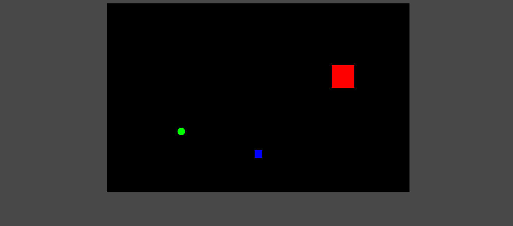

# JOGO DO PRONG EM JS
👨‍💻JOGO DO PRONG COM HTML E JS.

  

## DESCRIÇÃO:
O jogo "Prong" é uma versão simplificada de um jogo de ação em que o jogador controla um retângulo (jogador) e deve interagir com dois outros objetos: uma bola e um inimigo. O objetivo do jogo é evitar a colisão com o inimigo enquanto o jogador tenta interagir com a bola para aumentar seu tamanho e, ao mesmo tempo, evitar ser tocado pelo inimigo.

## CONTROLES:
- **Tecla `Seta para Cima` (`UP`)**: Move o jogador para cima.
- **Tecla `Seta para Baixo` (`DOWN`)**: Move o jogador para baixo.
- **Tecla `Seta para Esquerda` (`LEFT`)**: Move o jogador para a esquerda.
- **Tecla `Seta para Direita` (`RIGHT`)**: Move o jogador para a direita.

## PONTOS CHAVES:
- **Colisão com a Bola**: Faz com que a bola seja reiniciada e aumenta o tamanho do jogador, além de incrementar a velocidade do inimigo.
- **Colisão com o Inimigo**: Reduz o tamanho do jogador.
- **Movimento e Rebate**: A bola e o inimigo rebatem ao atingir as bordas da tela, mantendo o jogo dinâmico e desafiador.

## JOGANDO:
1. **Movimento da Bola**:
    - A bola se move continuamente pela tela, rebaterá nas bordas da tela e inverte sua direção quando atinge qualquer borda.
    - Se a bola colidir com o jogador, ela será reiniciada no centro da tela e o tamanho do jogador aumentará em 8.5 unidades.
    - A velocidade da bola também é incrementada quando ela toca o jogador.

2. **Movimento do Inimigo**:
    - O inimigo se move de forma autônoma pela tela em um padrão de rebote. Ele também inverte sua direção ao colidir com as bordas da tela.
    - Se o inimigo colidir com o jogador, o tamanho do jogador diminuirá um pouco (definido por `novoTamanhoDaBola`).

3. **Jogador**:
    - O jogador pode se mover pelas setas do teclado.
    - O jogador deve evitar o inimigo e interagir com a bola.
    - O jogador também deve evitar sair da tela. Se o jogador atingir as bordas da tela, ele será posicionado de volta para dentro da tela, em uma posição válida.

4. **Regras Adicionais**:
    - O tamanho máximo do jogador é 200 unidades.
    - O tamanho mínimo do jogador é 10 unidades.
    - A velocidade do inimigo aumenta conforme o jogador interage com a bola.

## NÃO SABE?
- Entendemos que para manipular arquivos em `HTML`, `CSS` e outras linguagens relacionadas, é necessário possuir conhecimento nessas áreas. Para auxiliar nesse aprendizado, oferecemos cursos gratuitos disponíveis:
* [CURSO DE HTML E CSS](https://github.com/VILHALVA/CURSO-DE-HTML-E-CSS)
* [CURSO DE JAVASCRIPT](https://github.com/VILHALVA/CURSO-DE-JAVASCRIPT)
* [CURSO DE CANVAS](https://github.com/VILHALVA/CURSO-DE-CANVAS)
* [CONFIRA MAIS CURSOS](https://github.com/VILHALVA?tab=repositories&q=+topic:CURSO)

## CREDITOS:
- [PROJETO BASEADO NO "JOGO DO PRONG"](https://github.com/VILHALVA/JOGO-DO-PRONG)
- [PROJETO EDITADO PELO VILHALVA](https://github.com/VILHALVA)
